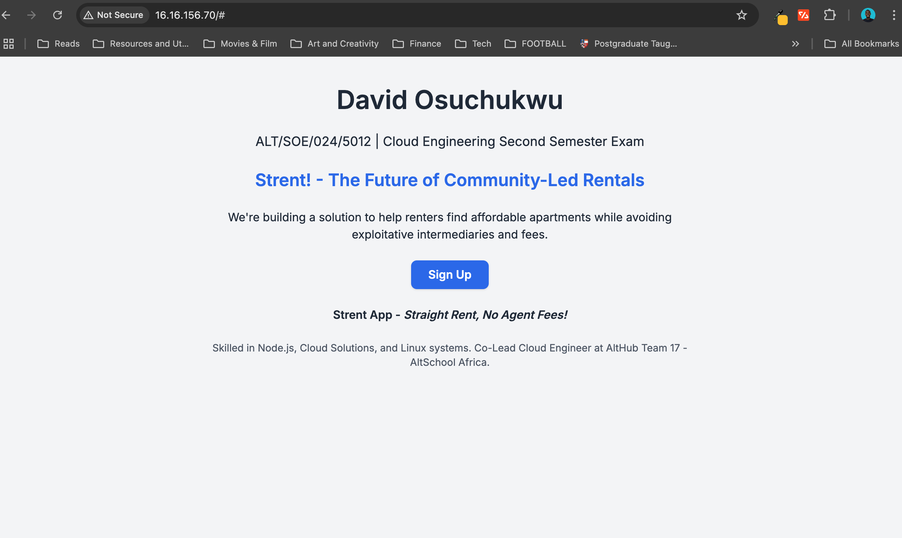

# AltSchool Africa Tinyuka Cloud Engineering Second Semester Exam

## Author
**David Osuchukwu**  
Student ID: `ALT/SOE/024/5012`  
Track: Cloud Engineering  

## Public URL

[http://ec2-16-16-156-70.eu-north-1.compute.amazonaws.com/](http://ec2-16-16-156-70.eu-north-1.compute.amazonaws.com/)

---

## Screenshot

---

## Steps taken to Deploy Project

### 1. Provisioned an AWS EC2 Ubuntu Server
- Region: `eu-north-1` (Stockholm)
- Created and downloaded the key-pair file.
- Set Security Group (Inbound and Outbound Rules):
  - HTTP (80), HTTPS (443), SSH (22) open to `0.0.0.0/0`
  - Connected and SSH'd into the instance using the public key.

### 2. Installed Required Software and Dependencies (Node, Nginx, Git, and npm)
`sudo apt update
sudo apt install nginx nodejs npm git -y`

### 3. Created a directory to set up my Node.js project
`mkdir tinyuka-exam && cd $_`
- Created server.js and added code to run a node server on port 3000,
- Created david.html and added the necessary html (used ChatGPT for speed, then modified generated content),
- Added Tailwind for styling,
- Ran the `nohup node server.js &` command to start the node server in the background

### 4. Set up Nginx as a reverse proxy
- Navigated to "/etc/nginx/sites-available/default" and replaced the "location" section with the following lines:
`location / {
        proxy_pass http://localhost:3000;
        proxy_http_version 1.1;
        proxy_set_header Upgrade $http_upgrade;
        proxy_set_header Connection 'upgrade';
        proxy_set_header Host $host;
        proxy_cache_bypass $http_upgrade;
    }`,
  then restarted the nginx web server using the command `sudo systemctl restart nginx`
- Tested the output by using `curl http://localhost:3000` and navigated to my EC2 public IP to view the webpage (attached as screenshot)
  
### 4. Initialized a Git repository
- Used `git init` to initialize a git repo in the root folder "tinyuka-exam",
- Set up the remote branch as an upstream,
- Added all files using `git add .`
- Committed files using `git commit -m`
- Pushed to GitHub using `git push origin main`
- Added README.md
- Created a PR
- Modified david.html
